# Setup Smart X PoC in Your AWS Account 🧑🏻‍💻

**The Smart-X PoC is a demonstrative implementation focusing on Web-DIDs, VCs and VPs within the ecosystem. By following the outlined steps, you can set up a live Smart-X environment in your cloud infrastructure.**

**Table of content**

-   [Prerequisites](#prerequisites)
-   [Clone Repo](#clone-the-repository)
-   [Deploy Smart-X](#deploy-smart-x)
    -   [Deploy the Stack](#deploy-the-stack-using-the-cloudformation-template)
-   [Configurations](#configurations)
    -   [SSH into EC2](#ssh-into-the-instance)
    -   [Changes in `configmap.yaml`](#change-variables-in-k8sconfigmapyaml)
    -   [Changes in `secret.yaml`](#change-variables-in-k8ssecretyaml)
    -   [Changes in `ingress.yaml`](#change-domain-names-in-k8singressyaml)
    -   [Changes in `issuer.yaml`](#change-email-in-k8sissueryaml)
    -   [Execute `run.sh`](#execute-runsh-🚀)
-   [Smart-X is Live !](#now-you-can-visit-your-app-on-gaiaxyour-domain)

## Intro

### Our Cloud Deployment

<p>
    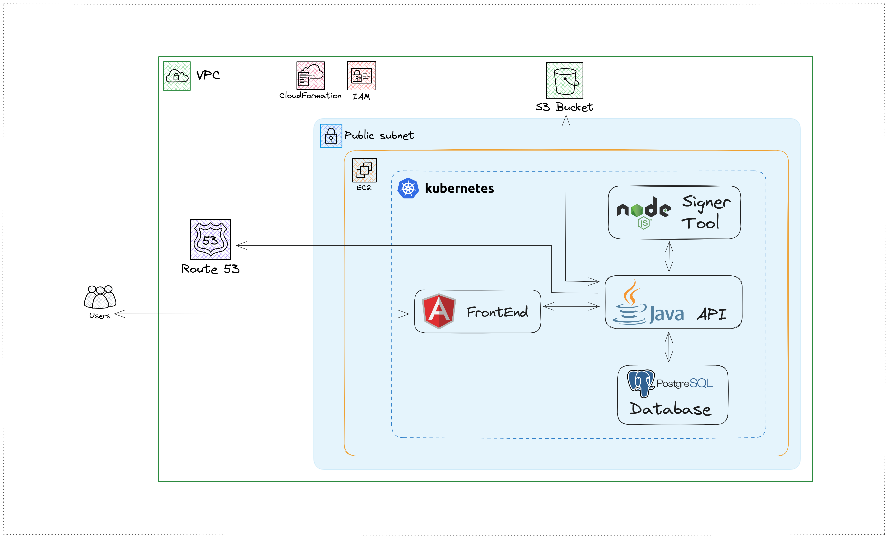
</p>

## Prerequisites

### AWS Account

Make sure you have an active AWS account for the setup.

If you don't have an AWS account, and want to setup only the frontend locally, please follow this [Readme](https://github.com/smartSenseSolutions/xfsc-workshop/blob/main/Exercise-1/frontend_readme.md)

### Domain Name 📌

Acquire a public domain name. This will be crucial for setting up a hosted zone in Route 53.

### Hosted Zone in AWS 🌐

Configure a hosted zone in AWS associated with your domain name. This enables the creation of new records and sub-domains.

### Key Pair for SSH 🔐

We have prepared this setup for two AWS regions: `US East(N. Virginia) us-east-1` and `Europe (Frankfurt) eu-central-1`. You can choose either one of these regions for your cloud deployment.

[Create a key pair](https://docs.aws.amazon.com/AWSEC2/latest/UserGuide/create-key-pairs.html) in your AWS account (in `US East(N. Virginia) us-east-1` or `Europe (Frankfurt) eu-central-1` region, according to your preference) for SSH access to your ec2 instance.

## Clone the Repository, If not done already

```sh
git clone https://github.com/smartSenseSolutions/xfsc-workshop/tree/main
```

## Deploy Smart-X!

🚀

### Deploy the Stack Using the CloudFormation Template

1.  Go to CloudFormation in your AWS Console.

    -   You can just search for "Cloudformation" in the search bar and navigate to Cloudformation Console
    <p>
    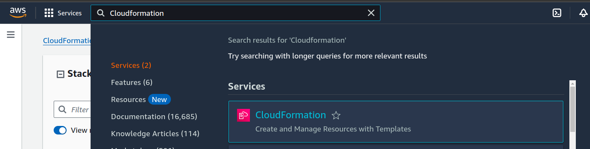
    </p>

    -   Select Region: `US East(N. Virginia) us-east-1` or `Europe (Frankfurt) eu-central-1`, keep the same region in which you have created your Key Pair in the steps above.
    <p>
    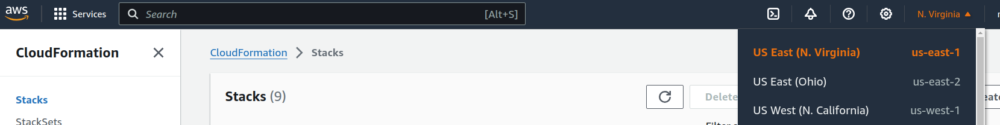
    </p>

2.  Create a new Stack: `With new resources(standard)`
    <p>
    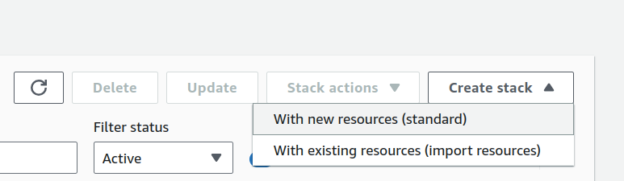
    </p>

    -   Under `Prerequisite`: Keep the default "Template is Ready" selected.

    -   Under `Specify Template`: Select "Upload a Template file"

    -   Upload the [template.json](https://github.com/smartSenseSolutions/xfsc-workshop/blob/6944e9b1928b23a76ba17f31b5d45316c965382e/Exercise-1/template.json) file from this repo.

    <p>
    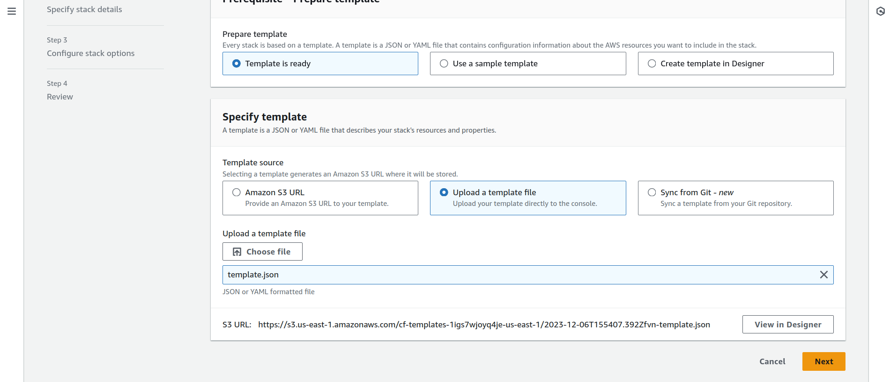
    </p>

    -   Click "Next"

3.  Specify stack details:

    -   `Stack Name`: Name you want to provide to the CloudFormation Stack (e.g., smart-x)

    -   `AmiID`: Provide the below AMI ID

        -   For region `US East(N. Virginia) us-east-1`

        ```sh
        ami-0be07fcf0f4e0c6af
        ```

        -   For region `Europe (Frankfurt) eu-central-1`

        ```sh
        ami-02d95d2d49a896d2f
        ```

    -   `AvailabilityZoneName`: Select your preferred availability zone.

    -   `DomainName`: Enter your domain name configured in the hosted zone (e.g., `smartsenselabs.com`).

    -   `HostedZoneId`: Select your configured hosted zone.

    -   `KeyPair`: Select a key pair for accessing your EC2 instance.

    -   `VpcName`: You can leave it as is or enter your preferred name.

    -   Click "Next"

4.  Configure stack options:

    -   Under `Stack failure options` select "Delete all newly created resources" for rollback.

    -   Click "Next"

5.  Review your stack:

    -   Acknowledge the warning by tickmark

    -   Click "Submit"

The CloudFormation stack is being provisioned. Wait until all resources are deployed (this may take a few minutes).

Refresh the Events Tab to see the status.

<p>
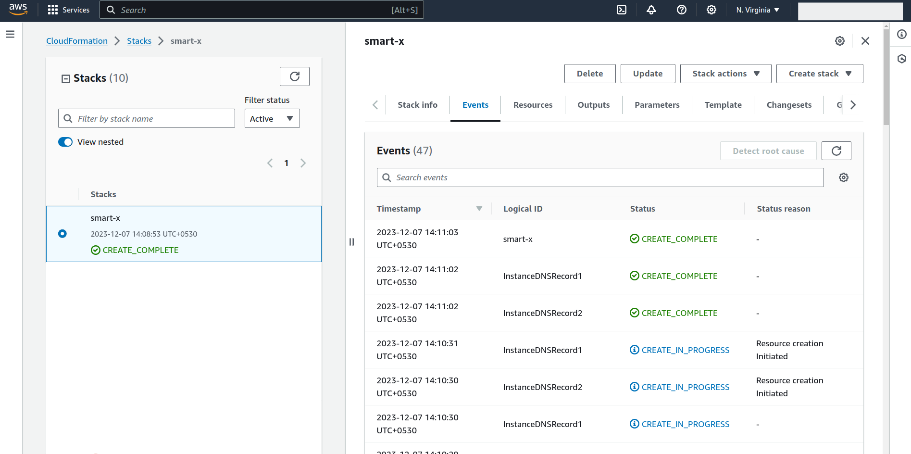
</p>

Once complete, view all deployed resources in the Resources tab.

<p>
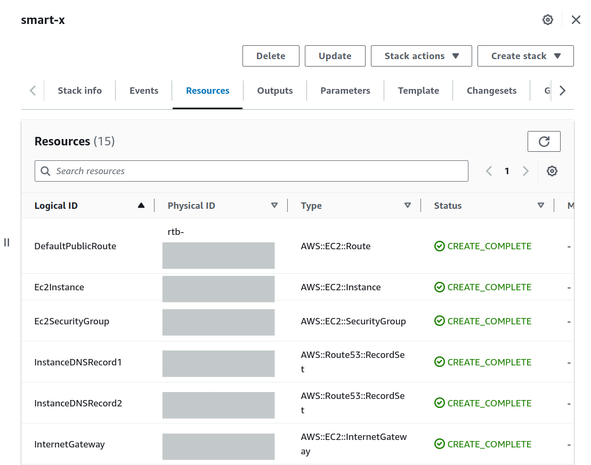
</p>

There are some details in the Output Tab after you cloudformation stack creation is done. Keep the Output tab open for further reference.

<p>
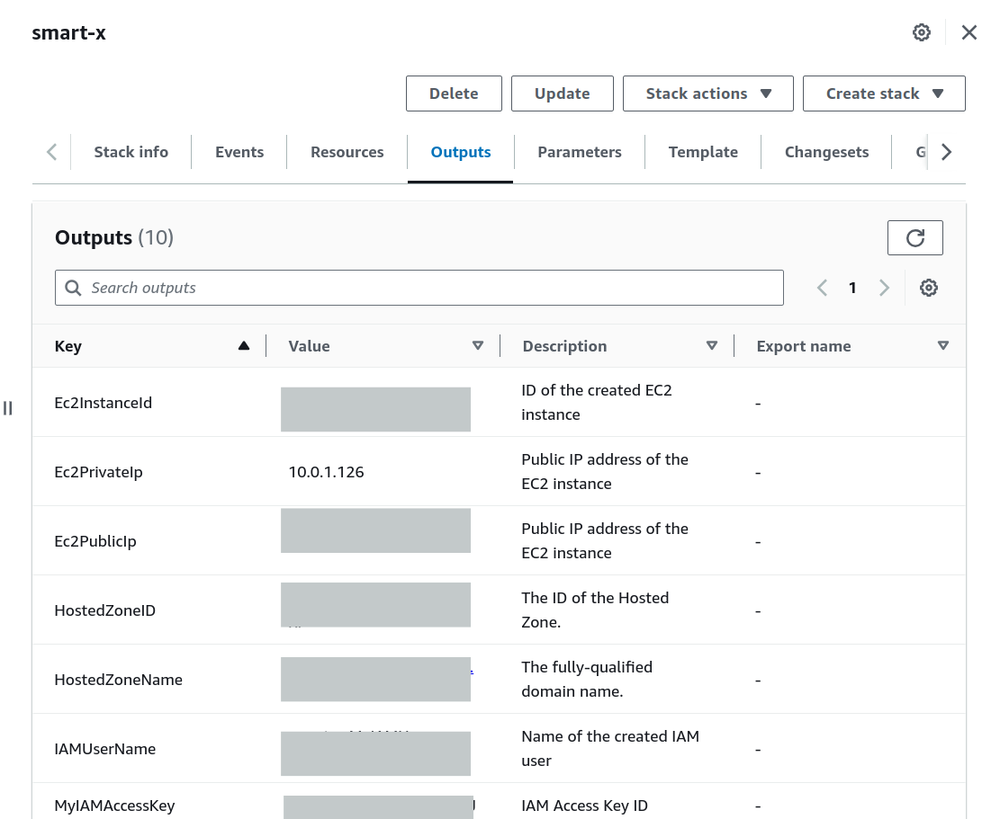
</p>

## Configurations

🔐

### SSH into the Instance

-   Copy the `Ec2PublicIP` from the Output section.

-   Open your terminal and ssh into the Instance:

    ```sh
    ssh -i {path-to-key.pem} ubuntu@{ec2-public-ip}
    ```

    -   **SSH Troubleshooting**

        -   `UNPROTECTED PRIVATE KEY FILE!`

            -   If you get an error regarding `WARNING: UNPROTECTED PRIVATE KEY FILE!`
                <p>
                    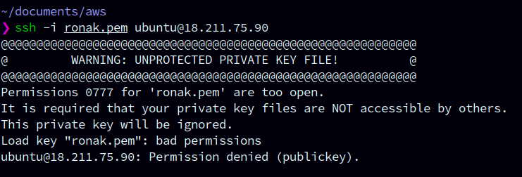
                </p>
            -   Execute the below command and then try to ssh again

                ```sh
                chmod 400 {path-to-key.pem}
                ```

        -   `Too many authentication failures`

            -   If you get an error regarding `Too many authentication failures`
                <p>
                    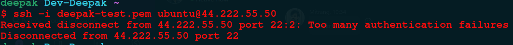
                </p>
            -   Add a additional flag `-o IdentitiesOnly=yes` to your ssh command and try again.

                ```sh
                ssh -o IdentitiesOnly=yes -i {path-to-key.pem} ubuntu@{ec2-public-ip}
                ```

Once you are in the Ec2 Instance, proceed with changing environment variables and configurations.

### Change Variables in `k8s/configmap.yaml`

🛠️

-   `SERVER_IP`: Set to "Ec2PublicIp" from the Outputs.

-   `K8S_BASE_PATH`: Set to "Ec2PrivateIP" from the Outputs
    (e.g., "https://{ec2-private-ip}:8443" -> "https://10.0.1.18:8443").

-   `BASE_DOMAIN`: Your Base Domain. Entered during the stack creation. You can also get it from the CloudFormation Output tab from field name "HostedZoneName".

-   `S3_BUCKET_NAME`: Set to "S3BucketName" from the Outputs.

-   `OCM_SERVER_HOST`: Provided. (If you want to use different OCM Engine, you can specify host here).

-   `HOST`: Replace with your domain name provided during the stack creation
    (e.g., "http://gaiax.{your-domain}:30017" -> "http://gaiax.smartsenselabs.com:30017").

Make sure indentation is correct while pasting values, as these are YAML files.

Save and close the file.

### Change Variables in `k8s/secret.yaml`

🔑

`NOTE!`: All the secrets in `secret.yaml` file should be base64 encoded. Also make sure you don't paste any new line characters with the encoded string.

This is an example below to create base64 encoding for `secretMessage`.

```sh
echo -n "secretMessage" | base64
```

<p>
    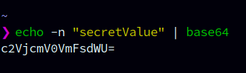
</p>

Similarly, you have to create base64 encoding for all the secret values as mentioned below before pasting them in `secret.yaml` file.

-   `AWS_ACCESS_KEY`: Set to base 64 encoding of 'MyIAMAccessKey' from the Outputs.

-   `AWS_SECRET_KEY`: Set to base 64 encoding of 'MyIAMSecretKey' from the Outputs.

-   `HOSTED_ZONE_ID`: Set to base 64 encoding of 'HostedZoneID' from the Outputs.

-   `CREDENTIAL_DEFINITION_ID`: Provided.

-   `PARTICIPANT_CREDENTIAL_DEFINITION_ID`: Provided.

-   Leave `K8S_TOKEN` as it is, it will be automatically generated.

Save and close the file.

NOTE: Base64 encoding is required only for `secret.yaml` file. Now, in further configurations you won't need to do that.

### Change Domain Names in `k8s/ingress.yaml`

Replace `[your-domain]` with your actual domain name in the `k8s/ingress.yaml` file.
(Total 6 places)

Don't keep the Square brackets from `[your-domain]`.

(e.g., "gaia-x.`[your-domain]`" will be "gaia-x.`smartsenselabs.com`")

<p>
    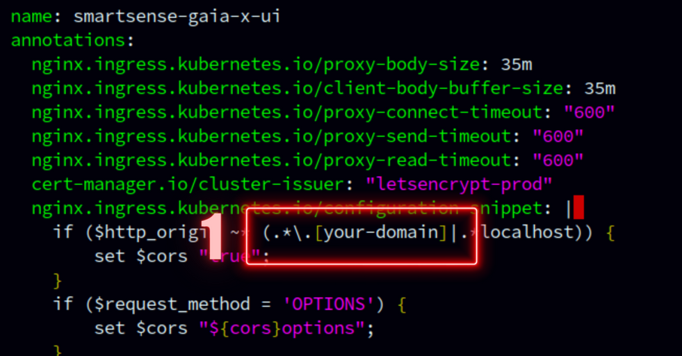
</p>

<p>
    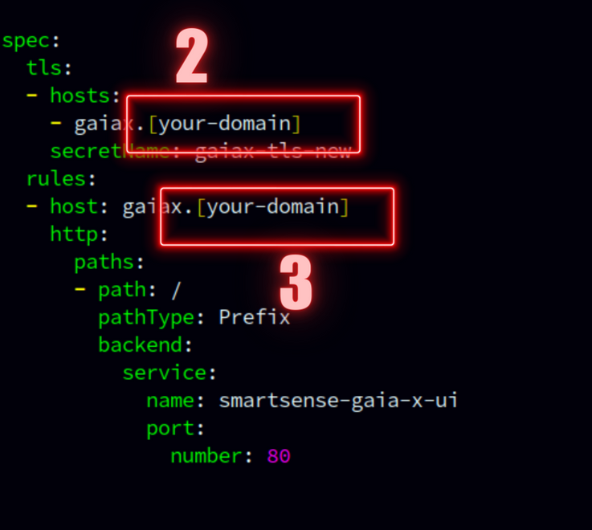
</p>

<p>
    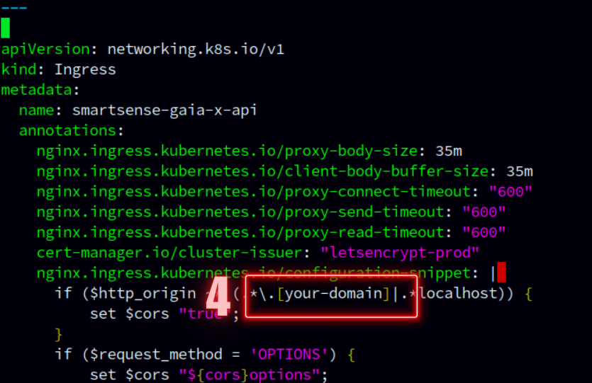
</p>

<p>
    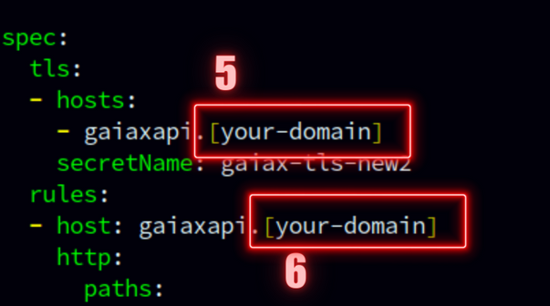
</p>

### Change Email in `k8s/issuer.yaml`

Enter your email address replacing `example@gmail.com`. Email will be used for ACME registration

### Execute `run.sh` 🚀

-   There is a shell script called `run.sh` in the root folder of your Ec2 Instance.

<p>
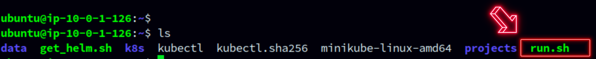
</p>

-   Execute that shell script with command below.

```sh
./run.sh
```

-   This process will take a few minutes to complete. Ensure that you don't stop the execution. Move ahead only after the execution is finished and you are prompted back to the terminal.

    -   If there are any errors, try to execute `run.sh` again.

        ```sh
        ./run.sh
        ```

Make sure `K8S_TOKEN` is properly set in `k8s/secret.yaml` file.

Lastly, run this command:

```sh
kubectl apply -f k8s/ingress.yaml
```

Wait for a few moments to ensure all services are up and running.

Verify your service running using `kc get po` command, the output of this should look like as below:


Some useful commands to debug:

1. View logs of the pod: `kc logs -f <pod name>`
2. View k8s service `kc get svc`
3. View k8s secret `kc get secret`
4. To apply k8s config file `kc apply -f  <file name>`
5. Restart pod: `kc delete po <pod name>`
6. Redeploy the application after code changes `deploy` and select the application number

## Now, you can visit your app on gaiax[your-domain].

<p align="center">
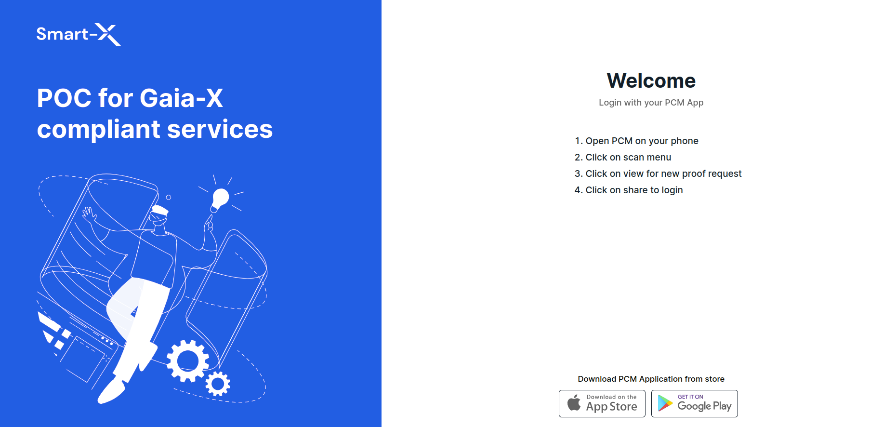
</p>

-   Visit your UI at - https://gaiax.{your-domain}/

-   Singer Tool Swagger - http://gaiax.{your-domain}:30017/docs/

-   Backend API are hosted here - https://gaiaxapi.{your-domain}/

-   Login to admin from given Credentials

## Register using UI with PCM

1. Download the [PCM application](https://play.google.com/store/apps/details?id=eu.gaiax.difs.pcm) from the Play Store and do the initial setup
1. Open https://gaiax.{your-domain}/admin-login
1. Login with username: `admin@smartsensesolutions.com` and password: `p9(E3lk&R`
1. Scan the QR code using PCM and accept the connection
1. Fill the form with required details( make sure you add VAT number: `FR79537407926`) and do registration
1. Once registration is done, click on login
1. Again scan QR code using PCM
1. Share credentials using PCM

## Source code

1. https://github.com/smartSenseSolutions/smartsense-gaia-x-api
2. https://github.com/smartSenseSolutions/smartsense-gaia-x-ui
3. https://github.com/smartSenseSolutions/smartsense-gaia-x-signer

## Note Regarding AWS Resource Charges

Numerous resources are provisioned in our AWS account via the CloudFormation template. Should you wish to continue utilizing the Smart-X PoC, you have the option to retain these resources within your AWS account. However, please be aware that maintaining these resources will result in charges corresponding to their usage duration.

To avoid incurring any charges, please follow the below section to remove all the resources from your AWS account.

## Delete all the Resources and Stack

-   Remove all the objects from your created S3 bucket.

    -   Go to your S3 bucket, you will get the bucket name, from cloudformation output section.
    -   Make sure there are not objects in your bucket, If there are objects, select all of them and delete.

-   Remove the Cloudformation stack

    -   You can easily remove the stack from the CloudFormation console. This action will effectively delete the associated resources which were provisioned during the stack creation.

    <p>
    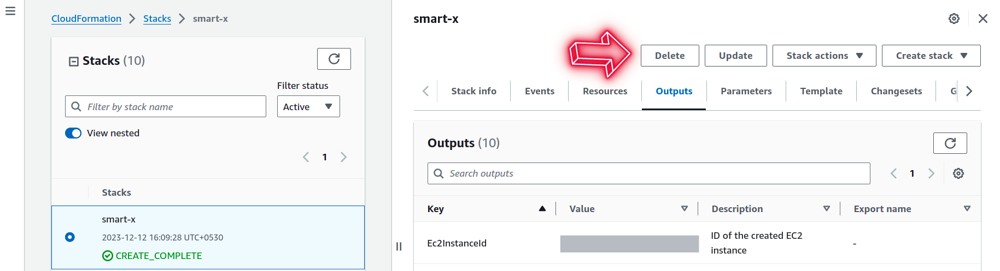
    </p>

-   Lastly, clear the records in HostedZone

    -   Go to your HostedZone.
    -   If you tried onboarding an enterprise on Smart-X POC, for example `xyz` company. There will be an `A` record of `xyz.{your-domain}` in your hostedzone. You can delete all such records.

-   HostedZone

    -   Having a HostedZone was a prerequisite for this deployment, so if you don't want to perform this deployment again, you can delete the HostedZone as well.

### Happy hacking! 🙌
