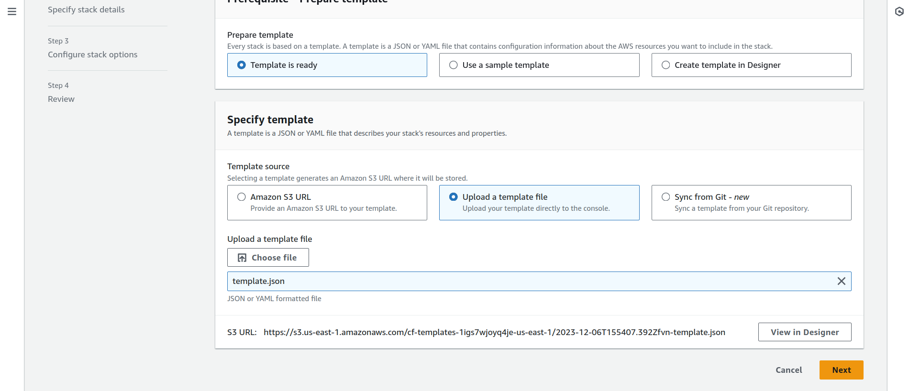
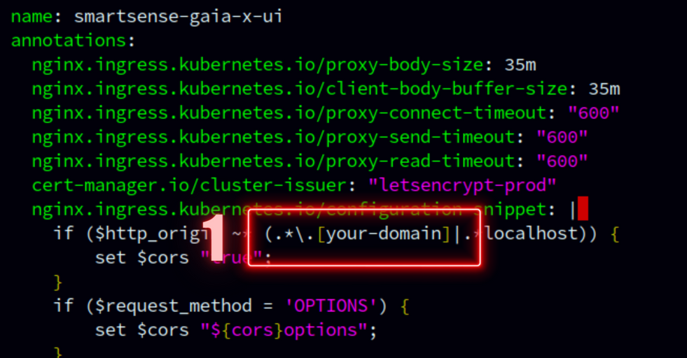
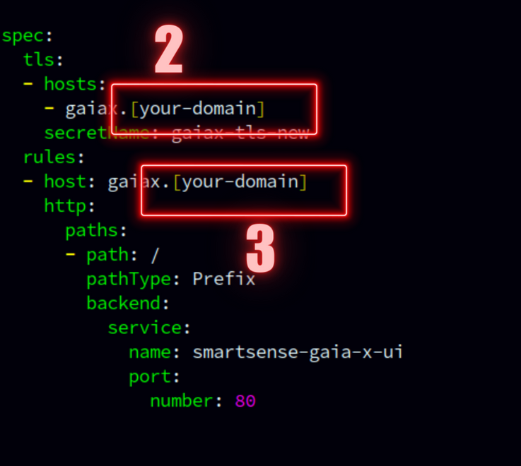
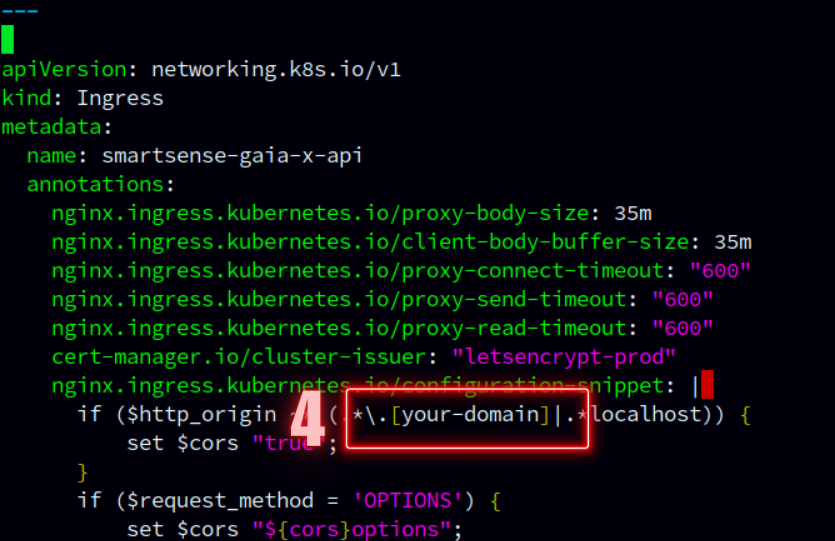

# Setup Smart X PoC in Your AWS Account 🧑🏻‍💻

Describing Smart X PoC and Table of content

-   [Prerequisites](#prerequisites)
-   [Deploy Smart-X](#deploy-smart-x-🚀)
    -   [Deploy the Stack](#deploy-the-stack-using-the-cloudformation-template)
-   [Configurations](#configurations)
    -   [SSH into EC2](#ssh-into-the-instance-🔐)
    -   [Changes in `configmap.yaml`](#change-variables-in-k8sconfigmapyaml-🛠️)
    -   [Changes in `secret.yaml`](#change-variables-in-k8ssecretyaml-🔑)
    -   [Changes in `ingress.yaml`](#change-domain-names-in-k8singressyaml-🌐)
    -   [Changes in `issuer.yaml`](#change-email-name-in-k8sissueryaml-📧)
    -   [Execute `run.sh`](#execute-runsh-🚀)
-   [Smart-X is Live !](#now-you-can-visit-your-app-on-gaiaxyour-domain)

## Prerequisites

### AWS Account

Make sure you have an active AWS account for the setup.

### Domain Name 📌

Acquire a public domain name. This will be crucial for setting up a hosted zone in Route 53.

### Hosted Zone in AWS 🌐

Configure a hosted zone in AWS associated with your domain name. This enables the creation of new records and sub-domains.

### Key Pair for SSH 🔐

[Create a key pair](https://docs.aws.amazon.com/AWSEC2/latest/UserGuide/create-key-pairs.html) in your AWS account (in your preferred region) for SSH access to your instance.

### Tiny URL Account and API Key 🔗

You'll need a Tiny URL account and API key for specific functionalities.

You can obtain your api key from [here](https://tinyurl.com/app/settings/profile)

<p>
    
</p>

## Deploy Smart-X! 🚀

### Deploy the Stack Using the CloudFormation Template

1.  Go to CloudFormation in your AWS Console.

    -   Select Region: `US East(N. Virginia) us-east-1`
    <p align="center">
    
    </p>

2.  Create a new Stack: `With new resources(standard)`
    <p align="center">
    
    </p>

    -   Under `Prerequisite`: Keep the default "Template is Ready" selected.

    -   Under `Specify Template`: Select "Upload a Template file"

    -   Upload the `template.json` file from this repo.

    <p align="center">
    
    </p>

    -   Click "Next"

3.  Specify stack details:

    -   `Stack Name`: Name you want to provide to the CloudFormation Stack (e.g., smart-x)

    -   `AmiID`: Provide the below AMI ID

    ```sh
    	ami-0048b0326e5148edc
    ```

    -   `AvailabilityZoneName`: Select your preferred availability zone.

    -   `DomainName`: Enter your domain name configured in the hosted zone (e.g., `smartsenselabs.com`).

    -   `HostedZoneId`: Select your configured hosted zone.

    -   `KeyPair`: Select a key pair for accessing your EC2 instance.

    -   `VpcName`: You can leave it as is or enter your preferred name.

    -   Click "Next"

4.  Configure stack options:

    -   Under `Stack failure options` select "Delete all newly created resources" for rollback.

    -   Click "Next"

5.  Review your stack:

    -   Acknowledge the warning by tickmark

    -   Click "Submit"

The CloudFormation stack is being provisioned. Wait until all resources are deployed (this may take a few minutes).

Refresh the Events Tab to see the status.

Once complete, view all deployed resources in the Resources tab and details in the Output Tab. Keep the Output tab open for further reference.

## Configurations

### SSH into the Instance 🔐

-   Copy the `Ec2PublicIP` from the Output section.

-   Open your terminal and ssh into the Instance:

    ```sh
    ssh -i /path/to/key.pem ubuntu@{ec2-public-ip}
    ```

    -   If you get an error regarding `WARNING: UNPROTECTED PRIVATE KEY FILE!`
        <p>
            
        </p>
    -   Execute the below command and then try to ssh again

        ```sh
        chmod 400 /path/to/key.pem
        ```

Once you are in the Ec2 Instance, proceed with changing environment variables and configurations.

### Change Variables in `k8s/configmap.yaml` 🛠️

-   `SERVER_IP`: Set to "Ec2PublicIp" from the Outputs.

-   `K8S_BASE_PATH`: Set to "Ec2PrivateIP" from the Outputs
    (e.g., "https://{ec2-private-ip}:8443" -> "https://10.0.1.18:8443").

-   `BASE_DOMAIN`: Your Base Domain (TODO: clarify its usage).

-   `S3_BUCKET_NAME`: Set to "S3BucketName" from the Outputs.

-   `OCM_SERVER_HOST`: Provided. (If you want to use different OCM Engine, you can specify host here)

-   `HOST`: Replace with your domain name provided during the stack creation
    (e.g., "http://gaiax.{your-domain}:30017" -> "http://gaiax.smartsenselabs.com:30017").

Make sure indentation is correct while pasting values, as these are YAML files.

Save and close the file.

### Change Variables in `k8s/secret.yaml` 🔑

Use below command in a second terminal to generate base64 encoded strings for all your secrets. All the secrets in `secret.yaml` file should be base64 encoded. Also make sure you don't paste any new line characters with the encoded string.

```sh
echo -n "secretMessage" | base64
```

<p>
    
</p>

-   `AWS_ACCESS_KEY`: Set to base 64 encoding of 'MyIAMAccessKey' from the Outputs.

-   `AWS_SECRET_KEY`: Set to base 64 encoding of 'MyIAMSecretKey' from the Outputs.

-   `HOSTED_ZONE_ID`: Set to base 64 encoding of 'HostedZoneID' from the Outputs.

-   `CREDENTIAL_DEFINITION_ID`: Provided.

-   `PARTICIPANT_CREDENTIAL_DEFINITION_ID`: Provided.

-   `TINY_URL_KEY`: Set to base 64 encoding of Your Tiny URL API key.

-   Leave `K8S_TOKEN` as it is, it will be automatically generated.

Save and close the file.

### Change Domain Names in `k8s/ingress.yaml` 🌐

Replace `[your-domain]` with your actual domain name in the `k8s/ingress.yaml` file.
(Total 6 places)

Don't keep the Square brackets from `[your-domain]`.

(e.g., "gaia-x.`[your-domain]`" will be "gaia-x.`smartsenselabs.com`")

<p>
    
</p>

<p>
    
</p>

<p>
    
</p>

<p>
    
</p>

### Change Email in `k8s/issuer.yaml` 📧

Enter your email address replacing `example@gmail.com`. Email will be used for ACME registration

### Execute `run.sh` 🚀

-   There is a shell script called `run.sh` in the root folder of your Ec2 Instance. Execute that shell script.

    ```sh
    bash run.sh
    ```

-   This process will take a few minutes to complete. Ensure there are no errors during file application.
    -   If there are any errors, execute
        ```sh
        kubectl apply -f k8s/ingress.yaml
        ```

Make sure `K8S_TOKEN` is properly set in `k8s/secret.yaml` file.

Wait for a few moments to ensure all services are up and running.

## Now, you can visit your app on gaiax[your-domain].

<p align="center">

</p>

-   Login to admin from given Credentials

### Happy hacking! 🙌
